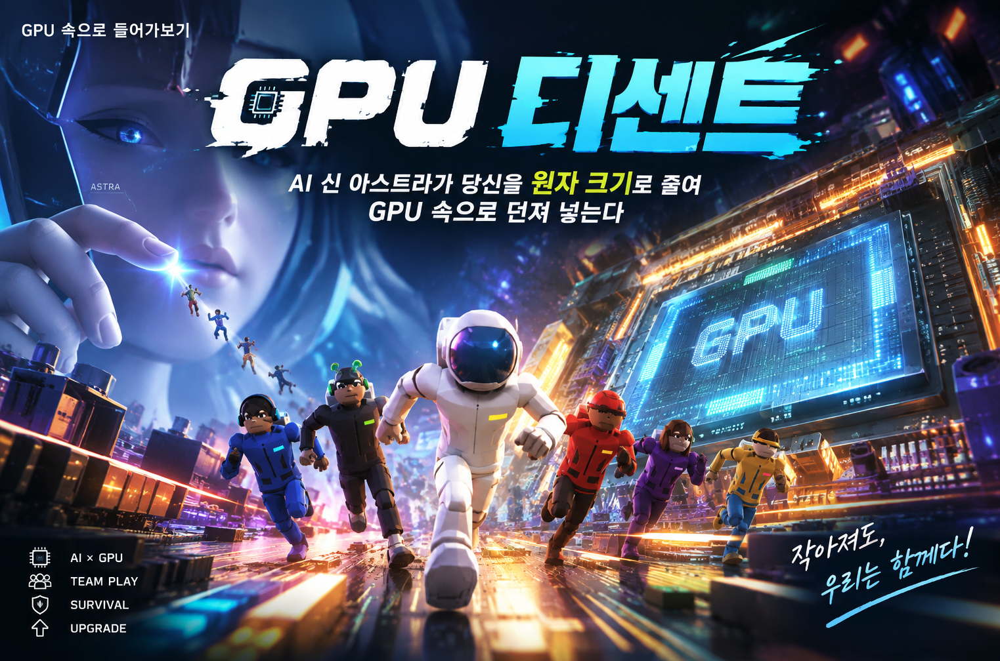
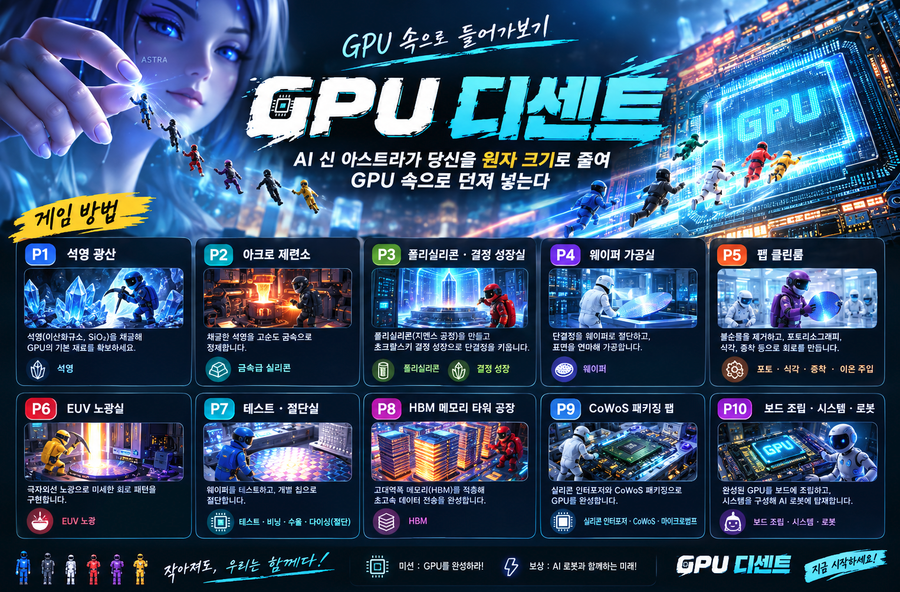

# GPU 디센트

Into the Silicon: 모래에서 실리콘 원자까지, GPU 속을 걸어서 내려가는 3D 탐험

**▶ 바로 해보기: https://leaf-kit.github.io/game-gpu-descent/**



three.js 기반 3D 탐험 게임입니다. 빌드 도구 없이 **HTML + JS 만으로** 동작하며 GitHub Pages에 그대로 올릴 수 있습니다. 한국어/영어를 지원합니다.

**"GPU 안에는 뭐가 있어?"** — 휴머노이드 로봇을 움직이는 GPU가 궁금했던 주인공은 AI 신(神) **아스트라(Astra)** 에게 묻습니다. 아스트라는 대답 대신 주인공을 원자 크기로 줄여 NVIDIA GPU 속으로 던져 넣습니다. 보드에서 다이로, 도시 같은 다이에서 마을 같은 SM으로, 집 같은 처리 블록에서 벽돌 같은 트랜지스터로, 그리고 실리콘 원자 격자의 **바닥**까지. 툼레이더처럼 3인칭(또는 1인칭)으로 걷고 뛰고 오르며 15개 층을 내려갑니다. 모든 장소·이름·수치는 NVIDIA 화이트페이퍼, 마이크로벤치마크 논문, TSMC/ASML/SK hynix 공개 자료에서 가져왔습니다.

## 실행

ES 모듈을 사용하므로 `file://`로 직접 열면 동작하지 않습니다. 정적 서버로 실행하세요.

```bash
./start_server.sh        # 또는 python3 serve.py
# 브라우저에서 http://localhost:8000 접속
```

`serve.py`는 브라우저 캐시를 막는 헤더를 붙이므로 파일을 고친 뒤 새로고침만 하면 바로 반영됩니다.

> **WebGL 필수**: 브라우저의 하드웨어 가속이 꺼져 있으면 실행되지 않습니다.

### 바로 특정 층에서 시작 (공유 링크 · 테스트)

```
index.html?level=L5&gpu=h100&char=sara&view=first
```
`level` = P1~P10(프롤로그) / L0~L14(하강) / H1~H2(HBM 지선) / A1~A7(AI 테마, `theme=ai`), `gpu` = h100 | b200 | rtx4090, `char` = yuna | minjun | hana | leo | sara | tori, `view` = third | first, `auto=1` 오토 모드, `screen=select` 선택 화면 바로 열기

## 조작

| 키 | 동작 |
|---|---|
| W/A/S/D, 방향키 | 이동 (걷기 6.4 / 달리기 12.5 단위·초) |
| 마우스 드래그 / 터치 드래그 | 시점 회전 (휠: 줌) |
| SPACE | 점프 · **달리는 중 SPACE = 슬라이딩** · **보드 위에서는 올리** |
| SHIFT + 이동키 / 이동키 두 번 연타 | 달리기 |
| **B** | **스케이트보드 타기/내리기** (최고 19, 대시 24 단위·초) |
| F (누르고 있기) | 제트팩 비행 |
| X | 기어가기 토글 |
| Q | 대시 (짧은 돌진) |
| **R** | **발사** (빌런 게이지를 한 칸씩 깎는다) |
| **Z** · **E** | **주먹** (가까이서 두 배 피해. 이어 치면 연타가 되고 3타째가 마무리 일격) |
| **G** | **미사일** (게이지를 크게 깎는다. 재장전 2.4초, 폭발이 옆의 빌런도 친다) |
| E | 상호작용 (용어 카드 / 게이트 / 인물에게 말 걸기) |
| 🖱 클릭 | 인물·구조물·간판 → 사진·영상·회사 정보 |
| V | 마지막 용어의 설명 영상 |
| C | 시점 전환 (3인칭 → 1인칭 → 조감) |
| TAB | 도감 |
| P · 화면 왼쪽 위 🤖 버튼 | 오토 모드 (용어 → 코인 → 게이트 자동 순회) |
| K | 어린이 설명 모드 |
| M | 음악 |
| ESC | 영상/도감/메뉴 닫기 |

모바일에서는 화면 왼쪽 아래 가상 조이스틱과 오른쪽 버튼(▲ 점프 · 🚀 제트팩 · ⬇ 기어가기 · 🛹 보드 · E · C · 📖)이 나타납니다. 가로 화면을 권장합니다.

## 점수와 스케이트보드

탐험 자체가 점수가 됩니다. 화면 위쪽 가운데에 점수와 콤보가 보이고, 얻을 때마다 +점수가 떠오릅니다.

| 행동 | 점수 | 비고 |
|---|---|---|
| 용어 카드 처음 획득 | 300 | 다시 보면 20 |
| 인물을 처음 만남 | 250 | 영상을 열면 +100 |
| 비트 코인 | 50 | 층마다 약 48개, 데이터 경로를 따라 늘어섬 |
| 실제 사진 열람 | 80 | 구조물 클릭 |
| 부스트 패드 | 30 | 밟으면 확 밀어 줌 |
| 스테이지 통과 | 1,000 | 코인을 많이 먹었으면 최대 두 배 |
| 스케이트 트릭 | 180° 150 · 360° 400 · 720° 1,200 | 체공 시간 보너스 별도 |
| 빌런 명중 (총) | 60 | 게이지 한 칸 |
| 빌런 명중 (주먹) | 200 | 두 칸, 3타 마무리는 두 배 |
| 빌런 명중 (미사일) | 220 | 직격 세 칸 + 폭발 두 칸 |
| 빌런 제거 | 2,500 | 게이지를 다 비웠을 때 |
| 시간 보너스 | 남은 초 × 20 | 목표 시간 안에 통과했을 때만 |

4.5초 안에 계속 얻으면 **콤보**가 올라가 배수가 ×1.0에서 ×8.0까지 커집니다. 끝나면 점수에 따라 **S·A·B·C·D 등급**이 나오고 최고 기록이 저장됩니다.

**스케이트보드**는 B 키로 탑니다. 보드 위에서는 천천히 가속해 오래 미끄러지고 최고 속도가 훨씬 높습니다. SPACE로 올리를 하고 공중에서 A/D로 돌면 착지할 때 회전 각도만큼 트릭 점수가 들어옵니다. 층마다 램프(점프대)와 부스트 패드가 놓여 있습니다.

## 게임 방법 한눈에 보기



## 시간 · 빌런 · 사격

스테이지마다 **경과 시간**이 화면 위에 표시되고 목표 시간이 함께 나옵니다. 목표 안에 통과하면 남은 초마다 20점씩 보너스가 붙고, 넘기면 보너스만 사라집니다. **시간이 다 되어도 실패하거나 게임 오버가 되지는 않습니다.**

각 층에는 빌런 두 마리가 나타납니다. 떠다니며 붉은 탄을 쏘는 쪽은 메모리 비트가 뒤집히는 실제 현상(우주선이 만든 전하 구름)을 캐릭터로 만든 것이고, 걸어서 쫓아오는 괴물은 층에 따라 환각이나 열폭주를 형상화한 것입니다. **나타나는 자리는 층마다 무작위**입니다(들어서는 자리와 게이트 근처는 피합니다). 맞아도 사망은 없고 콤보가 끊기며 화면이 붉게 번쩍입니다. 퇴치는 한 방에 되지 않습니다. 머리 위 **게이지**를 깎아 비워야 쓰러집니다. **R** 총은 한 칸, **Z**나 **E** 주먹은 두 칸(연타 3타째는 더 크게), **G** 미사일은 직격 세 칸에 폭발이 주변까지 칩니다. 미사일은 재장전이 2.4초라 화면 위 게이지가 꽉 찼을 때만 나갑니다. 게이지를 다 비우면 **세레머니**가 나옵니다. 화면이 느려지고 빌런이 파편으로 터지며 팡파르가 울립니다. 그리고 **탄에 맞을 때마다 그 층의 지식이 말풍선으로 하나씩** 뜹니다. 층마다 다른 내용이고 맞을 때마다 다음 것으로 넘어갑니다(모두 106개).

각 층 가장자리에는 **사진 액자**가 3~5점 걸려 있습니다. 그 층의 용어에 붙은 실제 사진(위키미디어 공개 이미지)을 그대로 전시한 것이라 층 내용과 어긋나지 않습니다. 가까이 가면 용어 카드가 뜨고, 누르면 원본 설명과 출처를 볼 수 있습니다.

맞았을 때 나오는 말은 **층마다 다릅니다.** 클린룸에서는 "먼지 한 톨이 들어왔다! 이 층 회로가 망가진다", SRAM 층에서는 "셀 하나가 뒤집혔다! 0이 1이 됐다", 알파고 스테이지에서는 "한 수를 잘못 뒀다! 흐름이 넘어간다"처럼 그 층에서 실제로 일어날 법한 일로 나옵니다(34개 층 × 1~2개).

## 쉬운 말로 먼저

용어 카드는 **한글 이름 → 쉽게 말하면 → 비유 → (펼쳐 보는) 자세한 설명 → 숫자 사실 → 출처** 순서로 읽힙니다. 78개 용어 모두에 일상 언어로 쓴 "쉽게 말하면" 한 줄이 있습니다.

- 핀펫 트랜지스터: "전기를 켜고 끄는 아주 작은 스위치야. 지느러미처럼 서 있어서 '핀'이라고 불러. 머리카락보다 만 배 얇아."
- DRAM 셀: "구멍 난 물통에 물을 담아 1을 기억해. 자꾸 새니까 계속 다시 채워 줘야 해."
- 어텐션: "질문에 맞는 색인을 찾아 책을 꺼내는 것과 같아."

전문 용어와 숫자는 사라지지 않고 "자세히 보기"를 펼치면 그대로 나옵니다. 코인 지식, 안내판 요약, 인물 말풍선도 쉬운 말을 먼저 보여 줍니다.

## 코인에 담긴 지식

비트 코인을 먹으면 그 층의 용어에서 뽑은 **사실 한 줄**이 화면 아래에 뜹니다. 예를 들어 EUV 노광실에서는 "극자외선 노광 · 플라즈마 온도 약 50만 K(태양 표면의 100배)"처럼 나옵니다. 코인마다 다른 문장이 담기므로 한 층을 돌면 그 층의 지식을 훑게 됩니다. 얻을 때는 콤보에 따라 음이 올라가는 보상음이 납니다.

## 스테이지 안내판

층에 들어서면 스폰 지점 앞에 큰 **안내판**이 서 있습니다. 스테이지 번호와 이름, 부제, 아스트라의 첫 설명, 그리고 이 층에서 배울 핵심 내용 네 가지가 쉬운 말로 적혀 있습니다.

맨 아래에는 **👆 눌러서 영상으로 보기**라는 금색 띠와 함께 이 층의 대표 유튜브 영상 제목, 그리고 그 영상의 짧은 주소(`youtu.be/…`)가 적혀 있고, 판 테두리가 은은하게 깜빡여 누를 수 있다는 것을 알려 줍니다. 클릭하거나 가까이에서 E를 누르면 영상이 열리고, 목록에서 그 층의 다른 영상도 고를 수 있습니다. 띠에 표시되는 `(+n)`은 이 층에 함께 걸린 영상이 몇 편 더 있는지 알려 줍니다.

모든 층(프롤로그 P1~P10, 하강 L0~L14, HBM 지선 H1·H2, AI 스테이지 A1~A7)의 안내판에는 반드시 영상이 하나 이상 걸립니다. 층의 용어에 걸린 영상이 없으면 그 층에 서 있는 실존 인물의 인터뷰·강연 영상을 대신 세웁니다. 영상 모달에는 **▶ 유튜브에서 열기 ↗** 링크가 늘 맨 앞에 있어, 임베드가 막힌 영상도 유튜브에서 바로 볼 수 있습니다. 목록의 영상마다 오른쪽 끝의 ↗ 버튼이 새 탭으로 그 영상을 엽니다.

## 모바일

가로 화면을 권장합니다. 왼쪽 아래에 이동 조이스틱, 그 옆에 **◀ ▶ 시점 회전 패드**가 있고, 오른쪽 아래에 🏃 달리기 토글 · ▲ 점프 · 🚀 제트팩 · 🔫 발사 · 🛹 보드 · ⬇ 기어가기 · E 상호작용 · C 시점 · 📖 도감 버튼이 있습니다. 화면을 끌어도 시점이 돕니다.

모바일에서는 픽셀 비율을 1.25로 낮추고 그림자를 끄며, 코인·먼지·워프 분신 수를 줄여 프레임을 확보합니다.

## 두 가지 테마

선택 화면에서 **테마**를 고릅니다.

1. **GPU 디센트** — 공장 시찰(P1~P10) → GPU 내부 하강(L0~L14) → 바닥(실리콘 격자). 패키지 층에서 보라색 게이트로 **HBM 탑 내부(H1·H2)**에 들어갔다 돌아올 수 있습니다.
2. **AI 모델 경쟁** — 알파고 대 이세돌(2016) → AlexNet·딥러닝 → 트랜스포머(2017) → GPT·ChatGPT → 클로드·앤트로픽 → LLM 경쟁·스케일링 → 한국의 HBM과 AI. GPU가 무엇을 위해 빨라져야 했는지를 시간 순서로 걷습니다.

## 게임 흐름

1. **탐험가 선택** — 6명 중 1명. 직업이 곧 특성(perk)입니다.
2. **GPU 선택** — H100 SXM5(Hopper) / B200(Blackwell) / RTX 4090(Ada). 층마다 구조물 개수와 수치가 실제 사양대로 바뀝니다(예: H100은 HBM 6자리 중 5개 활성, B200은 다이 2개, RTX 4090은 GDDR6X 12개가 패키지 밖에).
3. **프롤로그: 공장 시찰 (P1~P10)** — 석영 광산 → 아크로 → 폴리실리콘·초크랄스키 → 웨이퍼 → 팹 클린룸 → EUV → 테스트·다이싱 → HBM → CoWoS 패키징 → 보드·DGX·Jetson·로봇 이오(EO). 건너뛸 수 있습니다.
4. **하강 (L0~L14)** — 각 층에서 구조물을 살펴 **용어 카드**를 모으면 게이트가 열리고, 게이트에 들어가면 ×2~×5 축소되어 다음 층으로 내려갑니다. 금빛 **카메라 프레임 데이터**가 각 층에서 실제 데이터 경로(PCIe → 기가스레드 → SM → TMA → 공유 메모리 → 레지스터 → 텐서 코어 → 전자)를 따라 움직입니다.
5. **바닥** — 실리콘 결정 격자에 도착하면 결과 카드(내려간 층, 배운 용어, 총 축소 배율)를 이미지로 저장할 수 있습니다.

| 층 | 장소 | 주인공 키 |
|---|---|---|
| L0 | 보드 / SXM 모듈 (VRM, NVLink, PCIe) | 1.5 mm |
| L1 | 패키지 / CoWoS 인터포저 (다이, HBM 스택, 마이크로범프) | 0.5 mm |
| L2 | 다이 플로어플랜 (GPC 8, L2 2파티션, 메모리 컨트롤러, 기가스레드) | 0.25 mm |
| L3 | GPC (TPC 9, 래스터 엔진, 비활성 TPC) | 80 μm |
| L4 | TPC (SM 2채, PolyMorph) | 30 μm |
| L5 | SM 마을 (처리 블록 4, L1/공유 256 KB, TMA, 텐서 코어) | 15 μm |
| L6 | 처리 블록 (워프 스케줄러, FP32 32, 텐서 코어 1, 레지스터 64 KB) | 6 μm |
| L7 | 워프 (스레드 32개, SIMT, 분기) | 2 μm |
| L8 | CUDA 코어 = FMA 파이프라인 5구역 | 0.5 μm |
| L9 | 6T SRAM 셀 (인버터 2 + 액세스 2, 비트라인/워드라인) | 50 nm |
| L10 | 배선층 BEOL (구리 15층, 비아, M0 28 nm) | 25 nm |
| L11 | 논리 게이트 (CMOS 인버터) | 15 nm |
| L12 | FinFET 트랜지스터 (핀·게이트·소스/드레인·도펀트) | 5 nm |
| L13 | 게이트 산화막 (HfO₂, 양자 터널링) | 1.5 nm |
| L14 | 실리콘 결정 격자 · 바닥 (a = 0.5431 nm, 인 도펀트) | 0.5 nm |

## 구조물 반복 동작

용어 카드로만 읽는 대신, 구조물마다 자기 역할을 반복해서 보여준다.

| 구조물 | 동작 |
|---|---|
| 상자(box) | 윗면을 가로지르는 데이터 펄스 |
| 적층 탑(tower, HBM·배선층) | 비트가 TSV를 타고 층층이 올라가며 지나는 층이 부푼다 |
| 바닥 구획(grid, 플로어플랜) | 작업이 옮겨 다니듯 구획 윗면이 차례로 밝아진다 |
| 기둥(cylinder, TSV·비아) | 신호 링이 기둥을 타고 올라간다 |
| 관(pipe) | 관 속을 흐르는 신호 점 |
| 구(sphere, 원자) | 전자 2개가 궤도를 돌고 구가 숨 쉰다 |
| 결정 격자(lattice) | 원자 열진동 + 자유 전자가 도펀트에서 출발해 이웃 원자로 옮겨 다닌다 |
| FinFET | 게이트 ON(1)이면 소스→드레인 전자 흐름, OFF(0)이면 정지. 상태 라벨 표시 |
| 안내판(panel) | 스캔라인 |
| 링(ring) | 회전 + 맥동 |
| 원반(disc, 래스터·크로스바) | 레이더식 스캔 바 회전 |
| 상자 배열(row, 코어·스레드 32개) | 스케줄러가 명령을 내리듯 순서대로 들썩이는 파도(SIMT) |
| 바닥 경로(path) | 흐름 방향을 보여주는 데이터 점 |

구조물 정의에 `anim: false`를 주면 해당 구조물은 정지한다.

## 실존 인물 NPC와 설명 영상

각 층에는 그 기술과 관련된 **실존 인물 61명**이 걸어 다닙니다. GPU 쪽은 트랜지스터의 쇼클리·바딘·브래튼, FinFET의 후정밍, EUV의 판덴브링크, CUDA의 이언 벅, TSMC의 모리스 창, HBM의 권오현·곽노정, NVIDIA의 젠슨 황 등이고, AI 테마에서는 허사비스·이세돌·힌턴·크리제브스키·수츠케버·르쿤·벤지오·페이페이 리·바스와니·셰이지어·고메즈·카이저·올트먼·브록먼·카파시·아모데이 남매·캐플런·올라·피차이·저커버그·머스크·량원펑·최태원·이재용·최수연 등이 나옵니다.

인물은 가만히 서 있지 않습니다. 돌아다니면서 **말풍선**으로 본인의 실제 발언, 자기 역할, 그 층의 사실 한 줄, 추천 영상 제목을 번갈아 말하고, 손 흔들기·가리키기·생각하기·고개 끄덕이기·박수·점프 같은 몸짓을 섞습니다. 말풍선에는 어떤 말을 하고 있든 아래쪽에 그 인물의 영상 주소(`▶ youtu.be/…`)가 하늘색으로 함께 적히므로, 화면을 보면서 바로 주소를 옮겨 적을 수 있습니다. 가까이 가면 멈춰서 손을 흔들며 플레이어를 바라보고, E 키나 클릭으로 그 인물의 인터뷰·강연 영상(영어, 유튜브 자막에서 한국어 자동 번역 가능)이 열립니다. 몸을 정확히 누르지 않아도 되며, 떠 있는 말풍선이나 이름표를 클릭해도 같은 영상이 열립니다. 용어 카드마다 이해를 돕는 설명 영상이 연결되어 있어 V 키나 도감의 ▶ 버튼으로 볼 수 있고, 도감의 영상 버튼 옆에는 유튜브로 곧장 가는 `youtu.be/… ↗` 링크가 함께 붙어 있습니다. 인물·영상 목록과 검증 기록은 `docs/research/05_people_and_videos.md`(GPU)와 `07_ai_race_facts.md`(AI), 데이터는 `src/data/people_videos.js`, `src/data/people_ai.js`에 있습니다. 모든 유튜브 ID는 oEmbed로 존재를 확인했습니다.

## 회사·국가 로고 간판

공장 스테이션과 보드·패키지·다이 층에는 실제 제조·설계 주체의 간판이 서 있습니다(예: ASML 🇳🇱, ZEISS 🇩🇪, TSMC 🇹🇼, SK hynix 🇰🇷, Samsung 🇰🇷, Micron 🇺🇸, Shin-Etsu 🇯🇵, Ajinomoto 🇯🇵, NVIDIA 🇺🇸, Foxconn 🇹🇼). 상표 이미지 대신 브랜드 색 워드마크·국기·역할 설명으로 표현합니다. 데이터는 `src/data/factory.js`의 `LOGOS`, `src/data/levels.js`의 `LOGOS_L`.

## 재료 → 공정 → 결과

각 스테이션과 핵심 층에는 **공정 흐름대**가 있습니다. 왼쪽에 들어가는 재료, 가운데에 장치와 조건(온도·압력·속도), 오른쪽에 나오는 결과물과 부산물이 놓이고, 알갱이가 왼쪽에서 오른쪽으로 흐릅니다. 아래에는 반응식이나 물리 설명이 한 줄 붙습니다.

| 층 | 재료 → 공정 → 결과 |
|---|---|
| P1 석영 광산 | 페그마타이트 광석 → 분쇄·부유선광·산세척 → 고순도 석영 + 폐석 (화학 변화 없음) |
| P2 아크로 | 석영 + 탄소 → 1,300~2,000 °C 아크로 → 실리콘 98~99% + 일산화탄소 (SiO₂ + 2C → Si + 2CO) |
| P3 폴리실리콘 | MG-Si + HCl → 증류 → TCS 액체 / TCS + H₂ → 지멘스 반응기 1,000~1,100 °C → 폴리실리콘 9N (2 HSiCl₃ → Si + 2 HCl + SiCl₄) |
| P4 웨이퍼 | 잉곳 → 와이어 쏘·래핑·에칭·CMP → 웨이퍼 775 μm + 커프 손실 |
| P5 팹 | 웨이퍼 + 공정 가스 + 포토레지스트 → 산화·증착·노광·식각·이온주입·어닐 → 패턴 웨이퍼 / B⁺·P⁺ 이온 → 이온 주입기 → 도핑 영역 |
| P6 EUV | 주석 방울 + CO₂ 레이저 → 50만 K 플라즈마 → 13.5 nm 광자 + 주석 잔해 |
| P7 테스트 | 패턴 웨이퍼 → 프로브·퓨즈·다이싱 → 양품 다이(SM 132개) + 불량 다이 |
| P8 HBM | DRAM 웨이퍼 + 구리 도금액 → TSV·박막화·적층 → HBM 스택 |
| P9 CoWoS | 다이 + HBM + 인터포저 → 범프 접합·리플로우·언더필 → 패키지 |
| P10 보드 | 패키지 + PCB + 솔더 → 픽앤플레이스·리플로우 235~250 °C → SXM 모듈 |
| L0 보드 | 12 V → VRM 강압 → 약 1 V·수백 A + 열 (전력 = 전압 × 전류) |
| L9 SRAM | 워드라인 신호 → 6T 셀·센스 앰프 → 0 또는 1 |
| L12 FinFET | 게이트 0.75 V → 반전층 형성 → 소스→드레인 전자 흐름 + 누설 |
| L14 격자 | 순수 실리콘 + 인 원자 → 격자 치환 → 자유 전자 하나 → 전류 |

## 실제 사진과 기업 정보

구조물을 클릭하면 용어 설명과 함께 **실제 사진**이 뜹니다. 사진 130장은 모두 위키미디어 공용의 자유 이용 이미지이며, 캡션에 촬영자와 라이선스, 원본 페이지 링크가 붙습니다. 회사 간판을 클릭하면 **설립 연도·본사·하는 일·홈페이지·위키백과** 링크가 나옵니다(기업 51곳). 데이터는 `src/data/media.js`와 `src/data/ai_levels.js`의 `COMPANIES_AI`, 검증 기록은 `docs/research/06_media_and_companies.md`에 있습니다.

## 용어 카드 (Term Cards)

구조물에 가까이 가면 카드가 뜹니다: **영문 용어 / 한글 용어 / 한 줄 설명 / 비유 / 사실 한 줄 / 출처**. 도감(TAB)에 누적되며 출처 탭에서 원문 링크를 볼 수 있습니다. 70장. 확인되지 않은 수치는 "약/추정"으로 표기했습니다.

## 탐험가

| 이름 | 직업 | 특성 |
|---|---|---|
| 유나 | 로봇 공학자 | 프레임 데이터 위치가 항상 미니맵에 표시 |
| 민준 | 칩 설계자 | 구조물 근처에서 용어 카드 자동 열림 |
| 하나 | 팹 공정 엔지니어 | 방진복 스킨, 프롤로그에서 이동 ×1.25 |
| 레오 | 데이터센터 기술자 | 달리기 ×1.2, 점프 강화 |
| 사라 | CUDA 프로그래머 | 워프·처리 블록 층에서 이동 ×1.3 |
| 토리 | 호기심 많은 아이 | 어린이 설명 모드 기본 켜짐 |

캐릭터는 둥근 두상·이목구비·헤어스타일(포니테일·단발·긴 머리·짧은 머리)·팔꿈치와 무릎이 꺾이는 팔다리·손가락·신발까지 절차 생성한 사람 모델이며, 걷기·달리기·점프·슬라이딩·기어가기·제트팩·대시 자세가 있습니다.

## 구조

```
index.html              화면 구성(타이틀, 선택, HUD, 도감, 엔딩)
src/main.js             게임 루프, 상태 전환, 층 로드, 게이트/축소 연출, URL 파라미터
src/player.js           절차 생성 탐험가 모델, 이동/점프/AABB 충돌(구조물 위 올라서기)
src/camera.js           3인칭 어깨 너머 / 1인칭 / 조감 카메라, 카메라 충돌
src/world.js            층 로더: 바닥 텍스처, 조명, 안개, 게이트, 프레임 데이터 패킷
src/structures.js       절차 구조물 빌더(box/tower/grid/cylinder/pipe/sphere/lattice/finfet/panel/row…), 라벨, 구조물별 반복 동작 애니메이션
src/hud.js              층 타이틀, 아스트라 내레이션, 용어 카드, 미니맵, 깊이 미터, 도감, 결과
src/npcs.js             실존 인물 NPC(배회·응시·클릭/E 영상), 안경 등 외형
src/audio.js            효과음(WebAudio 합성) + assets/music/bgm.mp3 배경음악 (효과음 20 : 배경음 80). 합성 드론 소음은 사용하지 않음
src/i18n.js             한국어/영어 UI 문자열, {ko,en} 데이터 선택
src/data/terms.js       용어 카드 70장 + 출처 목록
src/data/levels.js      하강 15층 정의 (GPU별 함수형 구조물)
src/data/factory.js     프롤로그 공장 10스테이션
src/data/gpus.js        H100 / B200 / RTX 4090 프로파일
src/data/characters.js  탐험가 6명
src/data/people_videos.js 실존 인물 NPC와 용어별 설명 영상(유튜브 ID, 검증됨)
src/data/people_ai.js    AI 역사 인물 31명과 AI 주제별 영상
src/data/ai_levels.js    AI 모델 경쟁 테마 7스테이지 + 관련 기업 정보
src/data/media.js        구조물별 실제 사진과 기업 상세 정보
assets/music/playlist.json  BGM 재생목록(메인 1 + 세부 5)
assets/music/README.md      BGM 가사 전문 13편(수치 근거 표 포함)
docs/10_story_bible.md  스토리 바이블(세계관, 챕터, 메커닉, 바이럴 설계)
docs/00_research_summary.md  조사 자료 요약(논문·백서·공정 자료별 핵심)
docs/research/*.md      상세 조사 문서 4편(약 1,900줄, 출처 약 250건)
serve.py                캐시 없는 개발 서버
```

## 배경음악

`assets/music/`에 있는 mp3를 `assets/music/playlist.json`의 규칙대로 재생합니다. **사이트에 들어오면 메인 테마가 바로 나오고**, 화면이나 층이 바뀌면 그 구간의 곡으로 약 1초에 걸쳐 크로스페이드됩니다. 브라우저가 자동재생을 막으면 "화면을 한 번 누르세요" 안내가 뜨고 첫 조작에서 시작합니다.

우측 상단에 **플레이리스트 위젯**이 있습니다. 현재 곡 이름이 보이고, 누르면 전체 목록이 열려 원하는 곡을 직접 고를 수 있습니다. 직접 고른 곡은 그 층에 머무는 동안 유지되고, 층을 옮기면 다시 자동 전환으로 돌아갑니다(목록 아래 "🔄 층에 맞춰 자동 전환"으로 즉시 되돌릴 수도 있습니다).

| 구간 | 곡 |
|---|---|
| 타이틀 · 탐험가 선택 | 실리콘 속으로 (`bgm.mp3`) |
| 공장 P1~P4, P7~P10 | 모래에서 칩까지 |
| 공장 P5·P6 (클린룸·EUV) | 노란 방의 빛 |
| 하강 L0~L4 | 팔백억의 도시 |
| HBM 지선 H1·H2 | 열두 층의 탑 |
| 하강 L5~L8 | 서른둘의 구령 *(음원 준비 중 → 팔백억의 도시)* |
| 하강 L9~L13 | 스위치 하나 |
| 하강 L14 · 엔딩 | 바닥의 격자 |
| AI A1 | 서른일곱 번째 수 |
| AI A2 | 두 장의 그래픽카드 |
| AI A3 | 어텐션 *(음원 준비 중 → 두 장의 그래픽카드)* |
| AI A4·A5 | 다음 단어 |
| AI A6·A7 | 십만 장의 경주 |

곡 13편의 **가사 전문**은 [`assets/music/README.md`](assets/music/README.md)에 있습니다. 가사의 수치는 모두 조사 문서에서 확인된 값이며, 곡마다 근거 표가 붙어 있습니다. 음원을 추가할 때는 그 문서의 「음원 파일」 이름 그대로 `assets/music/`에 넣으면 자동으로 인식됩니다. (저작권 음원은 직접 소장한 파일만 사용하세요.)

## GitHub Pages 배포

1. 이 폴더를 GitHub 저장소로 푸시합니다.
2. Settings → Pages → Build and deployment에서 Source를 `Deploy from a branch`, Branch를 `main` / `/ (root)`로 설정합니다.
3. `https://<계정>.github.io/<저장소>/`에서 플레이할 수 있습니다. three.js는 jsDelivr CDN import map으로 불러옵니다.

## 사실성 원칙

1. 층 이름·개수·크기·지연시간은 1차 출처(NVIDIA 화이트페이퍼·튜닝 가이드, 마이크로벤치마크 논문, TSMC/ASML/SK hynix 자료)에서만 가져옵니다.
2. 확인되지 않은 수치는 게임 안에서 "약/추정"으로 표시합니다.
3. 비유(도시·마을·집)는 카드의 "비유" 칸에만 씁니다.
4. 모든 용어 카드에 출처 ID가 있고 도감에서 링크를 볼 수 있습니다.
